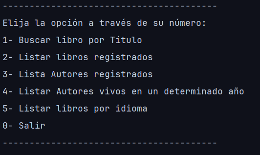
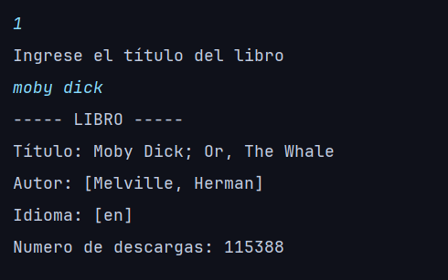
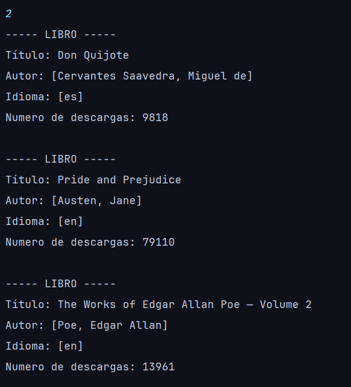
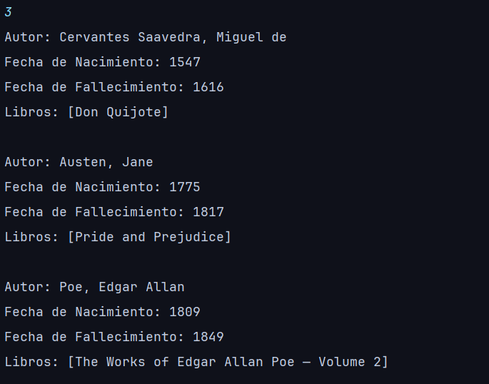
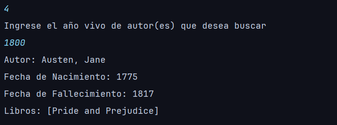
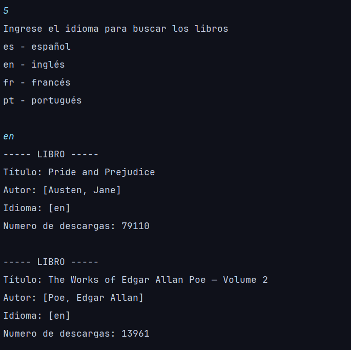

<h1 align="center">📚 LITERALURA </h1>

<p align="center">
  
</p>

<p align="center">
  
  &nbsp;
  
  &nbsp;
   &nbsp; 
   &nbsp; 
   </p>
</p>

---

## 📝 Descripción del Proyecto

Literalura es una aplicación de consola desarrollada en Java y Spring Boot que permite consultar información de libros y autores utilizando la API de Gutendex.
Funciona como un sistema simple de registro y consulta de libros con almacenamiento en PostgreSQL, usando el módulo JPA/Hibernate y procesando el consumo de una APIs REST.

Este proyecto forma parte del programa **Oracle Next Education (ONE)**.

---

## 🛠️ Tecnologías utilizadas

- Java 21
- Spring Boot 3
- JPA / Hibernate
- PostgreSQL 18
- Jackson
- API Gutendex
- IntelliJ IDEA
- Gestor de dependencias Maven
---

## 🚀 Características

- Buscar libro por título y guardarlo en base de datos
- Listar todos los libros registrados
- Listar libros por idioma
- Consultar autores vivos en un año específico
- Consumo de API REST con `HttpClient`
- Manejo de JSON con `Jackson`
- Manejo de DTOs
- Integración con API externa Gutendex para obtener información real de libros

---

## ▶️ Ejecución
Para ejecutar este proyecto se necesita configurar las variables de entorno o archivo de configuración:
1. Crea un archivo `application.properties` o `application.yml` en src/main/resources/:
```properties
spring.application.name=literalura

spring.datasource.url=TU_URL
spring.datasource.username=TU_USUARIO
spring.datasource.password=TU_CONTRASEÑA
spring.datasource.driver-class-name=org.postgresql.Driver
```
2. Ejecuta la aplicación desde IntelliJ: Run → LiteraluraApplication ó desde la terminal:
```bash
mvn spring-boot:run
```
3. Interactúa con la aplicación
:checkered_flag: Sigue las instrucciones en consola para buscar libros, listar autores y consultar según idioma o año
---

## 📷 Capturas del Proyecto
<h3>Menú</h3>

<h3>Opción 1</h3>

<h3>Opción 2</h3>

<h3>Opción 3</h3>

<h3>Opción 4</h3>

<h3>Opción 5</h3>


---

## 👤 Autor

| [<br><sub>Andrio Contreras</sub>](https://github.com/DranxFa) |
| :---: |
